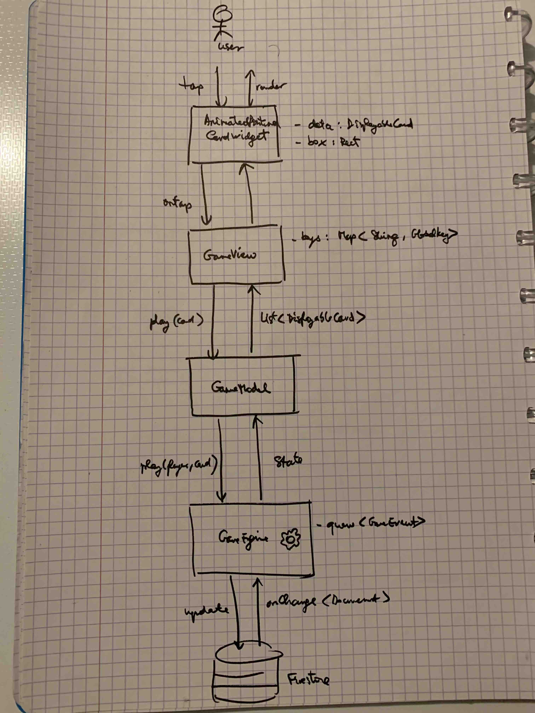

# SixTakes

6 takes! - Wolfgang Kramer's ingeniously simple card game with "bullheads" - Developed in Flutter

The aim of the game is avoid getting any cards. Each card you have to pick up will cost you minus points per bullhead on it. The player with the fewest bullheads at the end of the game is the winner.

## Features

- 6 takes! single player mode
- Multiplayer mode
- Leaderboard
- Available languages: English
- Available platforms: iOS, Android, Web

## Architecture

- MVVM using Provider
- Cards are AnimatedPositionned in Stack
- Automatic widget animation using GlobalKey
- Firebase Firestore

## Getting started

For help getting started with Flutter, view
[online documentation](https://flutter.dev/docs), which offers tutorials,
samples, guidance on mobile development, and a full API reference.

## Rights

Game idea, development, design, artwork, packaging, the 6 Takes! name and logo are all Copyright, and Trademarks or Registered Trademarks of Wolfgang Kramer, published by Amigo Spiele.
